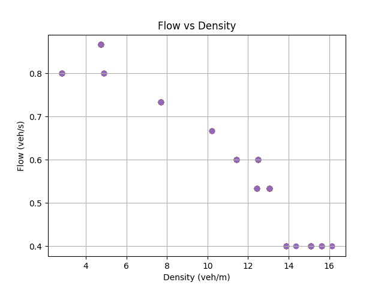
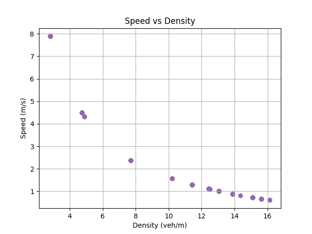

# ITSC 2024 Reproducibility in Transportation Research: A Hands-on Tutorial

>🔥 Here's a great example of how to organize code and data poorly.

You should be grateful I even shared my code. Good luck in getting it to work!

I used Python. Run `simulator.py` to get started.

Here are the results of my simulation:
 